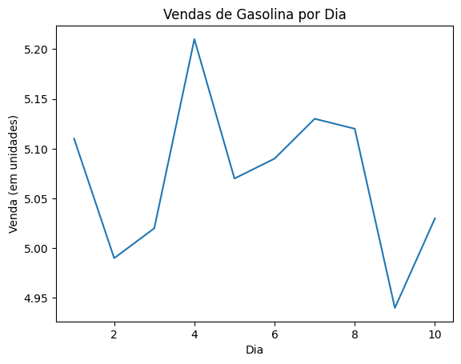

# Exercício da EBAC M18

Projeto de construção de gráfico

## Sobre

Este projeto foi desenvolvido como parte do curso da EBAC. Seu objetivo é utilizar os dados do arquivo 'gasolina.csv' para gerar um gráfico e, em seguida, salvar esse gráfico em um arquivo chamado 'gasolina.png'.

## Exemplo de Gráfico

## Ferramentas

- [Python](https://www.python.org/)
- [Seaborn](https://seaborn.pydata.org/)
